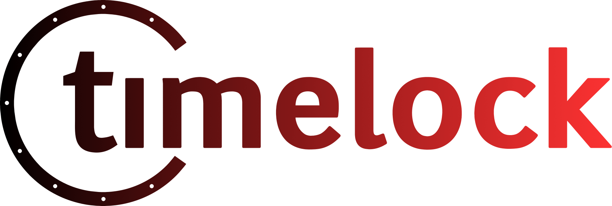
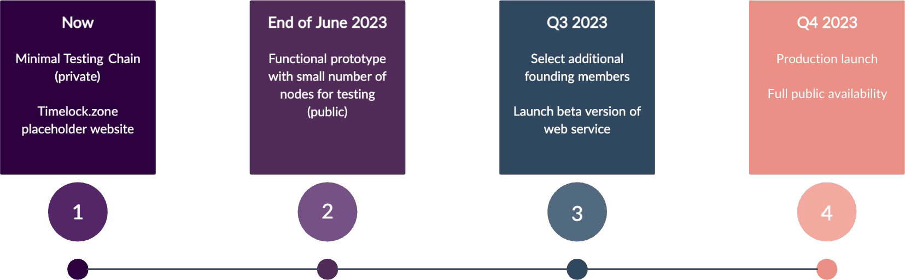

# TimeLock Cryptographic Service

[Timelock.zone](https://www.timelock.zone/) aims to serve as a public platform that allows companies and individuals to encrypt data for future decryption with support for various cryptographic systems, including the most popular [Elliptic curves](https://).

Timelock is being developed by the [Aragon ZK Research team](https://research.aragon.org/about/) using Gears, a COSMOS SDK written in [Rust](https://www.rust-lang.org/).

## Development Timeline

